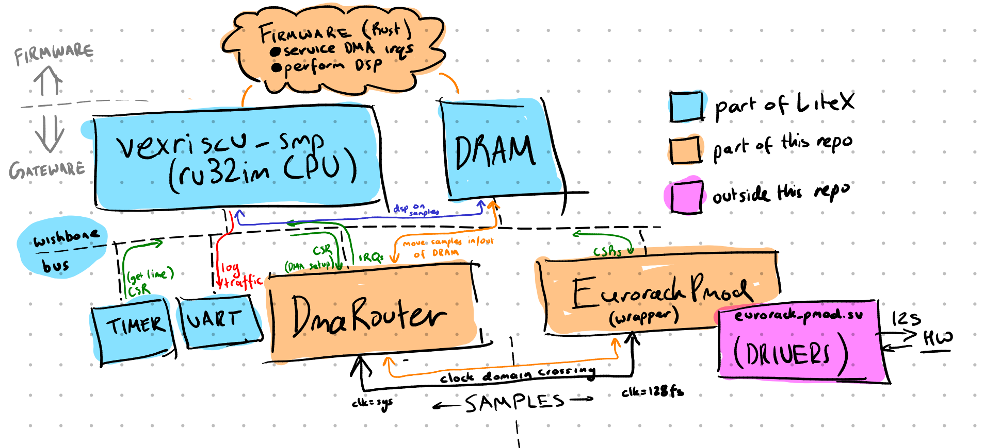

**WARN:** if you're just getting started with `eurorack-pmod` please [start here instead](https://github.com/apfelaudio/eurorack-pmod), this repository is a template for more advanced projects :)

# Real-time Audio DSP (in Rust, on a RISC-V softcore, on an FPGA).

## Example of using [eurorack-pmod](https://github.com/apfelaudio/eurorack-pmod) with LiteX.



The `example-ecpix-5.py` SoC in this repository has the following main parts:
- A softcore (RISCV `vexriscv_smp`, here we use `rv32im` without compressed instructions).
- A custom `dma_router` DMA engine which can shuttle data between RAM and the eurorack-pmod in real-time for glitch-free audio processing on the softcore (i.e in firmware).
- An instance of `eurorack-pmod` gateware where inputs/outputs can be peeked or poked through CSRs.

This example targets ECPIX-5, however given how little platform-specific code is in the SoC implementation, you should be able to easily port this to other FPGA boards.

# Example firmware

The example firmware, primarily found in `firmware/litex-fw/src` sets up the RISCV interrupt controller and maps the DMA interrupts such that we fire an IRQ at half and full on a shared circular DMA buffer.

Some example fixed-point DSP code in `dsp.rs` implements a low-pass filter. This example uses audio channel 1 as audio input, and audio channel 2 (CV) as the filter cutoff.

# Dependencies

For building the bitstream and LiteX BIOS:
- [oss-cad-suite](https://github.com/YosysHQ/oss-cad-suite-build)
- [RISCV toolchain](https://xpack.github.io/dev-tools/riscv-none-elf-gcc/install/)

For building the firmware:
- Rust NIGHTLY toolchain with some extras:
    - `rustup target add riscv32im-unknown-elf`
    - `cargo install svd2rust`

The bitstream and firmware are built in CI inside `.github/workflows/main.yml`, it may be useful to look at if you are missing some dependencies.

# Building a bitstream


```
<from this repository>
git submodule update --init --recursive
# e.g. for ECPIX-5
python3 example-ecpix-5.py --ecppack-compress --cpu-type vexriscv_smp --cpu-variant standard --csr-svd build/lambdaconcept_ecpix5/csr.svd --lx-ignore-deps --timer-uptime --cpu-count 1 --with-wishbone-memory --build
```

# Flashing the bitstream

```
# e.g. for latest ECPIX-5 revision
openFPGALoader -b ecpix5 --vid 0x0403 --pid 0x6011 build/lambdaconcept_ecpix5/gateware/lambdaconcept_ecpix5.bit
```

# Building the firmware (Rust)

Note: the `eurorack-pmod` gateware will respond to inputs (i.e LEDs changing) even if no firmware is flashed to the softcore. So you can see if things are kind of working even without firmware.

To build the bindings for LiteX CSRs (`litex-pac`), compile the firmware, and copy it into a binary file ready for uploading with `litex_term` --

```
cd firmware/
# e.g. for ECPIX-5 with your own OBJCOPY binary --
BOARD=lambdaconcept_ecpix5 OBJCOPY=riscv64-elf-objcopy ./build.sh
```

# Running the firmware

To see the LiteX terminal and download firmware to the device --

```
<from repo root>
./bin/litex_term --kernel build/lambdaconcept_ecpix5/rust-fw.bin /dev/ttyACM0
```


You should see something like this:

```
        __   _ __      _  __
       / /  (_) /____ | |/_/
      / /__/ / __/ -_)>  <
     /____/_/\__/\__/_/|_|
   Build your hardware, easily!

 (c) Copyright 2012-2023 Enjoy-Digital
 (c) Copyright 2007-2015 M-Labs

 BIOS built on Dec  5 2023 16:19:28
 BIOS CRC passed (44bb1c1c)

 LiteX git sha1: 2bf54c2d

--=============== SoC ==================--
CPU:            VexRiscv SMP-STANDARD @ 75MHz
BUS:            WISHBONE 32-bit @ 4GiB
CSR:            32-bit data
ROM:            128.0KiB
SRAM:           8.0KiB
L2:             8.0KiB
SDRAM:          512.0MiB 16-bit @ 300MT/s (CL-6 CWL-5)
MAIN-RAM:       512.0MiB

--========== Initialization ============--
Initializing SDRAM @0x40000000...
Switching SDRAM to software control.
....... and so on
```

And then once your firmware is loaded:

```
--============== Boot ==================--
Booting from serial...
Press Q or ESC to abort boot completely.
sL5DdSMmkekro
[LITEX-TERM] Received firmware download request from the device.
[LITEX-TERM] Uploading build/lambdaconcept_ecpix5/rust-fw.bin to 0x40000000 (13256 bytes)...
[LITEX-TERM] Upload calibration... (inter-frame: 10.00us, length: 64)
[LITEX-TERM] Upload complete (9.8KB/s).
[LITEX-TERM] Booting the device.
[LITEX-TERM] Done.
Executing booted program at 0x40000000

--============= Liftoff! ===============--
UART logger up!
hello from litex-fw!
<... garbage here ...>
irq_period: 199979
irq_len: 10093
irq_load_percent: 4
0@f4f0,e115
1@1c7c,1c7e
2@0,0
3@0,0
```


In this example on the ECPIX-5 the simple LPF DSP algorithm is consuming <5% of the available softcore CPU bandwidth. You also see a dump of the ADC sample values for each channel and see how often the IRQ is firing (200k cycles of 75e6Hz is about once every 2.7msec, which can be helpful for calculating latency).
